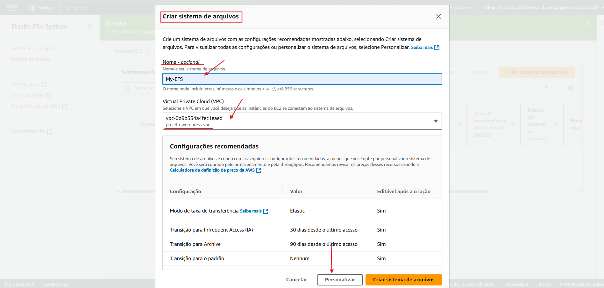
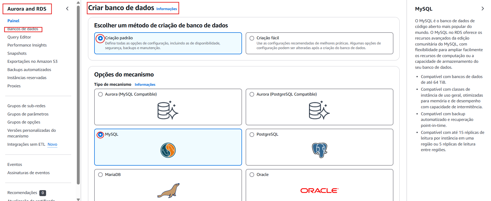
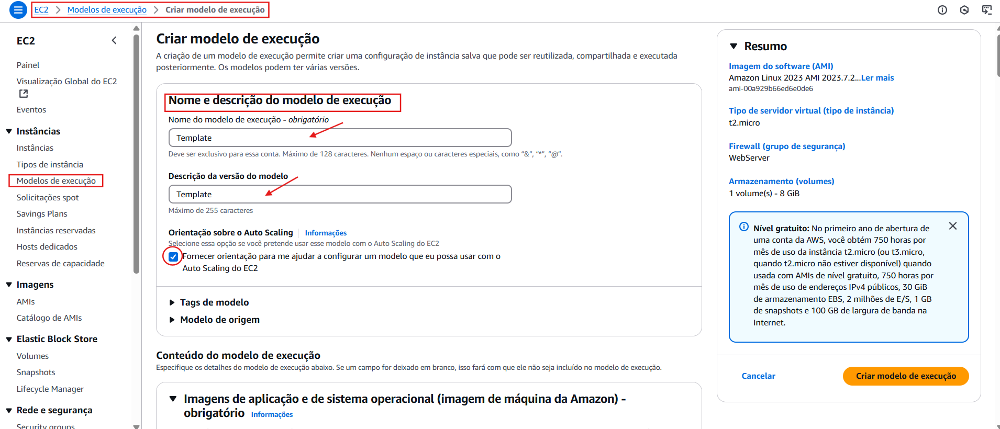
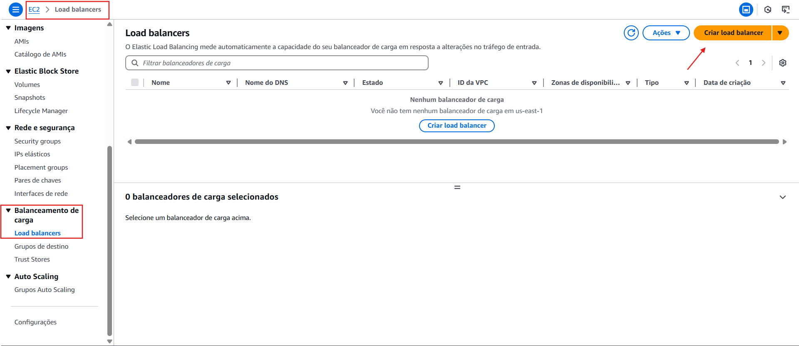

# Documentação do Projeto AWS - Docker
## Introdução
Este projeto tem como objetivo principal a configuração e o deploy de um servidor WordPress utilizando Docker em uma instância EC2 da AWS. A aplicação será estruturada de forma escalável e segura, garantindo alta disponibilidade e desempenho.

Para isso, serão utilizadas diversas tecnologias e serviços da AWS, como:
- **Amazon Web Services (AWS)**: Plataforma de nuvem utilizada para hospedar e gerenciar a infraestrutura do projeto.
- **Docker**: Para a criação e gerenciamento do contêiner que hospedará o WordPress.

- **Amazon EC2**: Servidor na nuvem onde o WordPress será executado dentro do contêiner Docker.

- **Amazon RDS (MySQL)**: Serviço de banco de dados gerenciado para armazenar os dados do WordPress.

- **Amazon EFS (Elastic File System)**: Sistema de armazenamento de arquivos compartilhado entre múltiplas instâncias.

- **AWS Load Balancer**: Balanceador de carga para distribuir o tráfego entre as instâncias e garantir disponibilidade.
- **GitHub**: Plataforma de versionamento utilizada para armazenar e gerenciar o código-fonte do projeto.

> ⚠️ **Nota Importante:**  
> Para a correta execução deste projeto, é essencial o uso das seguintes tecnologias:  
> - **GitHub**: Para versionamento e gerenciamento do código-fonte.  
> - **AWS (Amazon Web Services)**: Plataforma de nuvem utilizada para hospedar e gerenciar a infraestrutura.  
> - **Docker**: Para a criação e gerenciamento do contêiner da aplicação.  
>  
> O não uso dessas tecnologias pode comprometer a implementação e funcionamento do ambiente.


A configuração será realizada seguindo uma topologia predefinida e utilizando scripts de automação para facilitar a instalação dos serviços necessários. Além disso, boas práticas de segurança e desempenho serão aplicadas ao longo da implementação.

A seguir, apresentamos um guia passo a passo para configurar o ambiente e garantir o funcionamento adequado da aplicação.


## 1. Criar a VPC  
Antes de configurar a infraestrutura, é necessário criar uma **VPC (Virtual Private Cloud)** para isolar os recursos da aplicação.  

1. Acesse o **AWS VPC Console**.  
2. Clique em **Criar VPC**.  
3. Defina um nome para a VPC (exemplo: `projeto-wordpress-vpc`).  
4. Escolha um **bloco CIDR** adequado para a rede.  
5. Confirme a criação.  

## 2. Configurar as Sub-redes Públicas  
Após a criação da VPC, é necessário configurar as sub-redes públicas para que recebam IPs públicos automaticamente.  

1. No menu **Sub-redes**, selecione a **sub-rede pública** desejada.  
2. Clique no ícone de edição 🔄 (marcado na imagem).  
3. Ative a opção **Atribuir IP público automaticamente**.  
4. Salve as alterações.  

> 📌 **Importante**: Isso garante que as instâncias criadas dentro dessas sub-redes tenham um IP público e possam ser acessadas pela internet.


> 📌 **Importante**: Repita o mesmo processo com a outra sub-rede, a da segunda zona de disponibilidade.


# Configuração de Grupos de Segurança na AWS

## 3. Criar Grupos de Segurança 
Os **grupos de segurança (Security Groups - SGs)** são essenciais para controlar o tráfego de entrada e saída dos recursos na AWS. Nesta etapa, vamos criar os grupos de segurança necessários para cada componente da aplicação.
### 3.1 Criar o Grupo de Segurança do Servidor Web  
Primeiro, criamos um **grupo de segurança** para o servidor web, onde a aplicação WordPress será executada.  
1. Acesse o **AWS EC2 Console** e vá até **Grupos de Segurança**.  
2. Clique em **Criar grupo de segurança**.  
3. Defina um nome (exemplo: `SG-WebServer`).  
4. Associe o grupo à **VPC correta**.  
5. **Não adicione regras de entrada ou saída** neste momento.  
6. Clique em **Criar grupo de segurança**.  
📌 *Isso garante que o tráfego seja configurado de maneira controlada posteriormente.*

### 3.1 Criar o Grupo de Segurança para o RDS (MySQL)  
O banco de dados MySQL no Amazon RDS precisa de um grupo de segurança para permitir a comunicação apenas com o servidor web.  

### Configuração:  
- **Regras de Entrada:**  
  - **Tipo:** MySQL/Aurora  
  - **Personalizar:** Grupo de segurança do WebServer  
  - **Descrição:** Apontando para WebServer  

- **Regras de Saída:**  
  - **Tipo:** Mysql/Aurora  
  - **Personalizar:** Grupo de segurança do WebServer  
  - **Descrição:** Apontando para grupo de segurança WebServer   

 
 
---

## 3.2 Criar o Grupo de Segurança para o EFS  
O **Amazon EFS** armazenará arquivos compartilhados do WordPress, precisando de um grupo de segurança configurado corretamente.  

### Configuração:  
- **Regras de Entrada:**  
  - **Tipo:** NFS  
  - **Personalizar:** Grupo de segurança do WebServer  
  - **Descrição:** Apontando para WebServer  

- **Regras de Saída:**  
  - **Tipo:** NFS  
  - **Personalizar:** Grupo de segurança do WebServer  
  - **Descrição:** Grupo de segurança WebServer All Traffic  
 
 

---

## 3.3 Criar o Grupo de Segurança para o CLB (Classic Load Balancer)  
O **Load Balancer** precisa permitir acesso externo e encaminhar as requisições ao WebServer.  

### Configuração:  
- **Regras de Entrada:**  
  - **Tipo:** HTTP  
  - **Personalizar:** 0.0.0.0/0  
  - **Descrição:** HTTP for all  

- **Regras de Saída:**  
  - **Tipo:** HTTP  
  - **Personalizar:** Grupo de segurança do WebServer  
  - **Descrição:** Grupo de segurança WebServer HTTP 80  

  


---

## 3.4 Editar o Grupo de Segurança do WebServer  
Agora, configuramos o grupo de segurança do servidor web para permitir a comunicação com os demais serviços.  

### Configuração:  
- **Regras de Entrada:**  
  - **Tipo:** HTTP  
  - **Personalizar:** Grupo de segurança do CLB  
  - **Descrição:** Permite tráfego do Load Balancer  

- **Regras de Saída:**  
  - **Tipo:** MySQL/Aurora  
  - **Personalizar:** Grupo de segurança do RDS  
  - **Descrição:** Comunicação com o banco de dados  

- **Adicionar Regra:**  
  - **Tipo:** HTTP  
  - **Personalizar:** Grupo de segurança do CLB  
  - **Descrição:** Permite tráfego do Load Balancer  

- **Adicionar Regra:**  
  - **Tipo:** Todo o tráfego  
  - **Personalizar:** 0.0.0.0/0  
  - **Descrição:** Liberação de tráfego total  

- **Adicionar Regra:**  
  - **Tipo:** NFS  
  - **Personalizar:** Grupo de segurança do EFS  
  - **Descrição:** Permite acesso ao armazenamento EFS  

  
 

---

### 📌 Observação  
Essas configurações garantem que cada serviço tenha acesso apenas ao necessário, melhorando a segurança da infraestrutura.  

## 3.5 Criar o Amazon EFS  

Agora, vamos configurar o **Elastic File System (EFS)** para armazenar os arquivos compartilhados do WordPress.  

### Passos:  
1. Acesse o serviço **EFS** na AWS.  
2. Clique para criar um novo **sistema de arquivos**.  
3. Avance para a próxima aba.  
4. Dê um nome ao seu EFS, selecione a VPC e clique em personalizar.  

  
 
 
 - Role para baixo e clique em próximo para ir para a próxima etapa


- Nesta etapa 2 você vai selecionar as zonas de disponibilidade A e B, certificar que o ID da sub-rede das suas estejam privadas e colocar o grupo de segurança do EFS que criamos anteriormente. Passe pela etapa 3, vá para etapa 4 revise e clique em criar.

  
---

🔹 **Nota:** O EFS permite que várias instâncias acessem os mesmos arquivos simultaneamente, garantindo escalabilidade e redundância.  

# 4. Criar o Amazon RDS (MySQL)

Nesta etapa, vamos configurar o serviço de banco de dados da AWS que será utilizado pela nossa aplicação WordPress.

### Passos:

- Acesse o serviço **RDS** no painel da AWS.
- Clique em **Criar banco de dados**.
- Em tipo de criação, escolha **Padrão**.
- Em mecanismo do banco de dados, selecione **MySQL**.

 

- Escolha a **versão mais recente** disponível.
- Em camada gratuita, selecione a opção **Elegível ao nível gratuito**.

### Configurações principais: Guarde essas informações.
- **Nome de usuário principal:** defina um nome fácil de lembrar.  
- **Senha do banco:** crie uma senha segura e **anote essas informações** — elas serão usadas mais adiante.


- **Classe da instância:** selecione `db.t3.micro` (inclusa no nível gratuito).

- **Armazenamento:** marque a opção **Habilitar armazenamento escalável automaticamente**.

- **Limite máximo de armazenamento:** defina conforme necessário (ex: 25 GiB).

### Rede:
- Certifique-se de que o banco está na **VPC correta**.
- Na seção de **conectividade**, selecione o **grupo de segurança do RDS** que você criou anteriormente.


- Em acesso público deixe a opçãp "Não" selecionada, em "Grupo de segurança de VPC" marque a opçãp "Selecionar existente" e marque o grupo de RDS criado anteriormente.


### Banco de dados inicial:
Antes de finalizar a criação:
- Dê um nome ao banco de dados inicial (por exemplo: `db_wordpress`).  
- Anote esse nome, pois será necessário na configuração do WordPress.
- Desmarque a opção o "Backup"


- Role para baixo e crie o banco de dados.

---

🚨 **Atenção:**  
A criação do RDS pode **demorar alguns minutos**. Você pode acompanhar o status na seção "Bancos de dados" do RDS.


## 5. Pegue e armazene o endereço do banco de dados e do ponto de montagem EFS.

- RDS


- EFS


## 6. Altere o script deste documento, userdata e docker-compose.yml para que contenha suas informações.

- User-data
```
#!/bin/bash

sudo yum update -y
sudo yum install -y docker wget amazon-efs-utils

sudo service docker start
sudo systemctl enable docker.service
sudo usermod -aG docker ec2-user

sudo curl -L "https://github.com/docker/compose/releases/latest/download/docker-compose-$(uname -s)-$(uname -m)" -o /usr/local/bin/docker-compose
sudo chmod +x /usr/local/bin/docker-compose

sudo mkdir -p /wordpress
sudo mount -t efs -o tls fs-01a854ff3d8732353:/ /wordpress

wget -O /home/ec2-user/docker-compose.yml https://raw.githubusercontent.com/BeatrizJulianaOliveira/Project-wordpress/refs/heads/main/Docker-compose.yml 
sudo chown ec2-user:ec2-user /home/ec2-user/docker-compose.yml

cd /home/ec2-user
sudo docker-compose up -d
```
- Docker-compose.yml
```
services:
  web:
    image: wordpress
    restart: always
    ports:
      - "80:80"
    environment:
      WORDPRESS_DB_HOST: rds.c1oigkqq4mak.us-east-1.rds.amazonaws.com 
      WORDPRESS_DB_USER: seu-user
      WORDPRESS_DB_PASSWORD: sua-password
      WORDPRESS_DB_NAME: db_wordpress
    volumes:
      - /wordpress:/var/www/html
```
# 7. Criar um Modelo de Execução (Launch Template)

Nesta etapa, vamos criar um modelo de execução que será utilizado para iniciar instâncias EC2 automaticamente com as configurações necessárias.

### Passos:

- Acesse o serviço **EC2** e clique em **Modelos de execução (Launch Templates)**.
- Clique em **Criar modelo de execução**.
- Escolha um nome para deu Template, uma descrição e ative a opção para fornecer orientação de ajuda para uso do Auto Scaaling



- **Imagem (AMI):** selecione o sistema **Amazon Linux** (esse passo é importante, pois o script do *User Data* foi feito para essa imagem).


### Configurações principais:

- **Tipo de instância:** mantenha a configuração padrão ou escolha uma adequada ao projeto.
- **Par de chaves (Key Pair):** selecione uma existente ou crie uma nova, se necessário.
- **Sub-rede:** **não selecione nenhuma sub-rede específica** (o Auto Scaling definirá isso automaticamente).


- **Grupo de segurança:** selecione o **grupo de segurança do WebServer** (aquele criado para o servidor que rodará o WordPress).


### Avançado:

- **Tags de recurso:** adicionei as tags fornecidas pelo programa de bolsas.
- Role para baixo, em **Detalhes avançados** e **Dados do Usuário:**, insira o conteúdo do script no campo *User data* (ele será executado automaticamente na criação da instância).
- Clique em Criar modelo.

> ⚠️ **Importante:**  
> No script do *User Data*, você deve **editar o ponto de montagem** para corresponder ao ID do seu **sistema de arquivos EFS**.  
> Exemplo: substitua o valor `fs-xxxxxxxx:/` pelo valor real do seu EFS, como `fs-08887fa7af31be953:/`.


---

# 8. Criar um CLB (Classic Load Balancer)

Agora vamos criar um **Classic Load Balancer (CLB)**, que será responsável por distribuir o tráfego de acesso entre os servidores que vão rodar nossa aplicação.

### Passos:

-  Acesse o serviço **EC2** no painel da AWS.
-  No menu lateral, clique em **Load Balancers** e depois em **Criar Load Balancer**.




-  Selecione a opção **Classic Load Balancer (CLB)**.
   > 💡 Note que essa opção aparece em um menu adicional separado das outras.

### Configurações iniciais:
- **Nome:** escolha um nome descritivo para o Load Balancer.


- **VPC:** certifique-se de que está selecionando a VPC correta.
- **Sub-redes:** selecione as **sub-redes públicas** onde estão (ou estarão) os servidores Web.
- **Grupos de segurança:** selecione o grupo de segurança do CLB criado anteriormente.


### Verificação de Integridade (Health Check):

- Por padrão, a checagem de integridade usa o caminho **`/index.html`**.
- Altere esse caminho, se necessário, para o endpoint correto da sua aplicação (como `/` ou `/health`), dependendo do comportamento do seu servidor web.


4. Clique em **Criar** para finalizar a configuração.

> ✅ **Pronto!** O CLB será criado e já estará pronto para ser utilizado.

---


 
