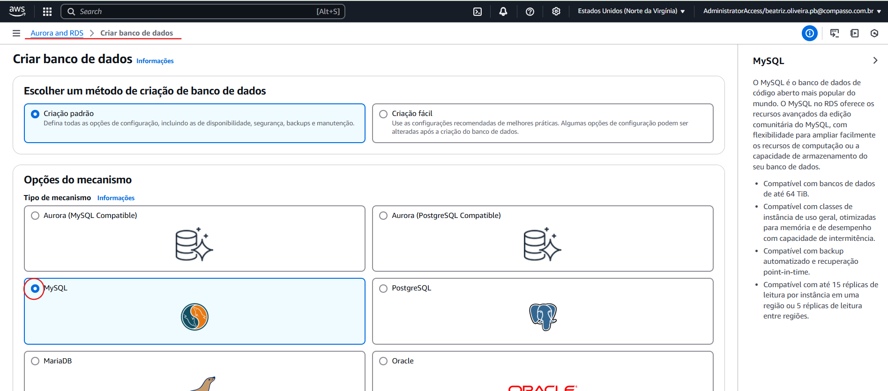
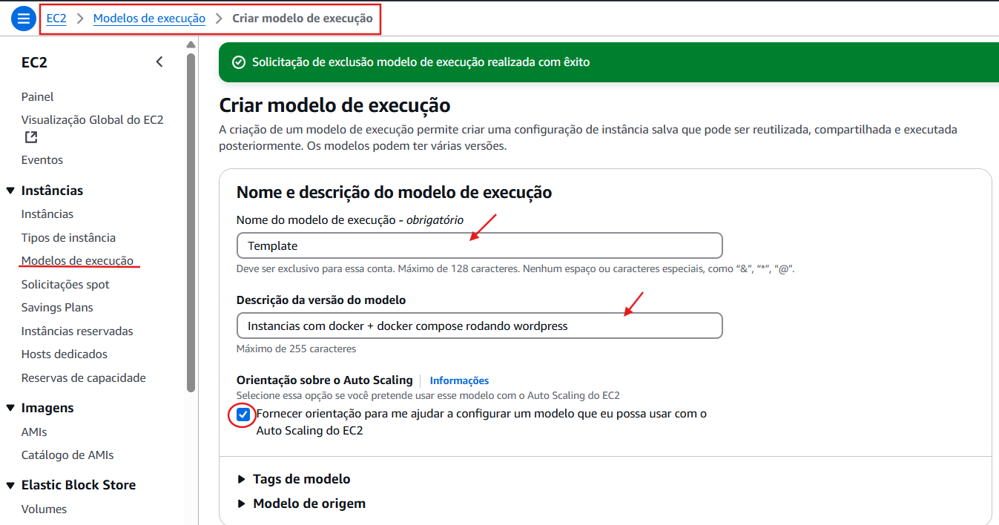
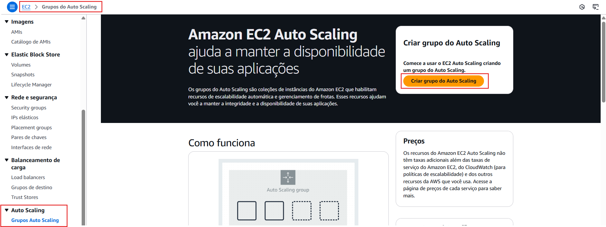

# 🚀 Configuração de Servidor Wordpress com Docker na AWS

## 🛠 Tecnologias utilizadas
- **GitHub**
- **Amazon Web Services (AWS)**
- **Visual Studio Code**
- **Docker**

> **Observação:** É essencial utilizar o **GitHub** para a elaboração e versionamento deste projeto.

---

## 🎯 Objetivo

Este projeto tem como objetivo configurar um servidor **WordPress** utilizando **Docker** dentro de uma instância EC2 na **AWS**. O ambiente será integrado com diversos serviços da AWS, como:

- **Amazon EFS** (armazenamento de arquivos)
- **Amazon RDS** (banco de dados)
- **ALB** (Application Load Balancer - balanceamento de carga)
- **ASG** (Auto Scaling Group - escalabilidade automática)

---

## 📌 Passo a passo

### 1️⃣ Criar uma **VPC** na AWS


---

### 2️⃣ Configurar **sub-redes públicas**  
- Habilitar a opção para que as sub-redes recebam **endereços IP públicos automaticamente**


> **Agora repita o mesmo processo com a sub-rede publica da zona B.**


---

### 3️⃣ Em security group, crie o **Security Group** para o servidor web  
*(Não adicione regras de entrada/saída neste momento)*

### 4️⃣ Criar o **Security Group** para o banco de dados (RDS - MySQL)


---

### 5️⃣ Criar o **Security Group** para o EFS


---

### 6️⃣ Criar o **Security Group** para o ALB (Application Load Balancer)


---

### 7️⃣ Editar o **Security Group** do WebServer  
- Adicione as **regras de entrada** e **saída** conforme necessidade da aplicação WordPress


---

### 8️⃣ Criar o **EFS**

- Pela barra de pesquisa, selecione **EFS**


- Adicione o nome do seu EFS


#### - Aperte para ir para próxima aba
#### - Selecionar o grupo de segurança do EFS criado anteriormente

### 9️⃣ Criar o RDS.

- Escolher a ultima versão disponível

- Escolher o nivel gratuito

- Guarde as informações de credenciais:

- Mudar para t3 micro:

- Alterar o limite maximo de armazenamento escalonavel:

- Verificar se está na VPC correta:

- Selecionar o grupo de segurança do RDS

- Antes de finalizar a criação RDS, definir um nome pro banco de dados inicial e guardar essa informação


- Pegar e armazenar o endereço do banco de dados && o ponto de montagem EFS.
- RDS

- EFS


Alterar esse userdata && o docker-compose.yml para que contenha suas informações
- User-data

```bash
#!/bin/bash

sudo yum update -y
sudo yum install -y docker wget amazon-efs-utils

sudo service docker start
sudo systemctl enable docker.service
sudo usermod -aG docker ec2-user

sudo curl -L "https://github.com/docker/compose/releases/latest/download/docker-compose-$(uname -s)-$(uname -m)" -o /usr/local/bin/docker-compose
sudo chmod +x /usr/local/bin/docker-compose

sudo mkdir -p /wordpress
sudo mount -t efs -o tls fs-08887fa7af31be953:/ /wordpress

wget -O /home/ec2-user/docker-compose.yml https://raw.githubusercontent.com/BeatrizJulianaOliveira/Project-wordpress/refs/heads/main/Docker-compose.yml
sudo chown ec2-user:ec2-user /home/ec2-user/docker-compose.yml

cd /home/ec2-user
sudo docker-compose up -d
```
- docker-compose.yml
```bash
services:
  web:
    image: wordpress
    restart: always
    ports:
      - "80:80"
    environment:
      WORDPRESS_DB_HOST: db-my-wordpress.c1oigkqq4mak.us-east-1.rds.amazonaws.com
      WORDPRESS_DB_USER: seu-usuario
      WORDPRESS_DB_PASSWORD: sua-senha
      WORDPRESS_DB_NAME: db_my_wordpress
    volumes:
      - /wordpress:/var/www/html
    networks:
      - tunel

networks:
  tunel:
    driver: bridge
```

- Criar um Modelo de Execução (Lauch Template)


- Em Imagens de aplicação, escolher o linux aws (o userdata só funciona para nele)

- Role para baixo, em tipos de instâncias escolha a **t2.micro** do nível gratuito. Em pares de chaves, selecione alguma que você tenha.


- Em configurações de rede, não escolha uma sub-rede especifica e escolha o grupo de segurança criado para os servidores web


- Role para baixo, em Tags de recurso coloquei as que foram determinadas pelo programa de bolsas.  Mais abaixo, em detalhes avançados cole o arquivo no user-data (observação: terá que trocar o ponto de montagem pelo que está no seu EFS).

- Crie o modelo de execução.


- Clique em Auto Scaling e vamos criá-lo.

Selecione o ALB

Coloque um nome nele e escolha as subnets que serão responsaveis pelo servidor web

### 9.Criar o ASG com o ALB 
Colocar um nome && ecolher o launch template que criamos anteriormente
Escolher as subnetes publicas de zonas diferentes para o LT
