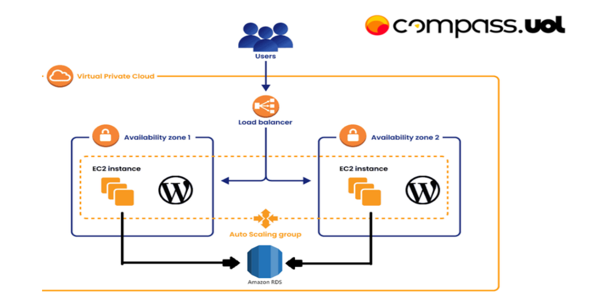
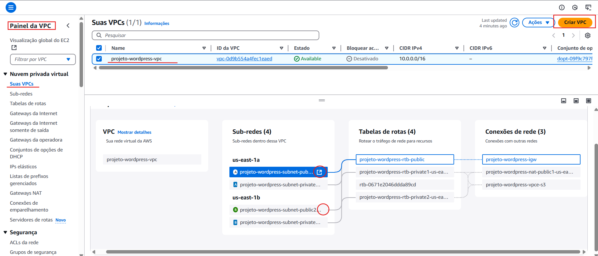

# Documentação do Projeto AWS - Docker
## Introdução
Este projeto tem como objetivo principal a configuração e o deploy de um servidor WordPress utilizando Docker em uma instância EC2 da AWS. A aplicação será estruturada de forma escalável e segura, garantindo alta disponibilidade e desempenho.

Para isso, serão utilizadas diversas tecnologias e serviços da AWS, como:
- **Amazon Web Services (AWS)**: Plataforma de nuvem utilizada para hospedar e gerenciar a infraestrutura do projeto.
- **Docker**: Para a criação e gerenciamento do contêiner que hospedará o WordPress.

- **Amazon EC2**: Servidor na nuvem onde o WordPress será executado dentro do contêiner Docker.

- **Amazon RDS (MySQL)**: Serviço de banco de dados gerenciado para armazenar os dados do WordPress.

- **Amazon EFS (Elastic File System)**: Sistema de armazenamento de arquivos compartilhado entre múltiplas instâncias.

- **AWS Load Balancer**: Balanceador de carga para distribuir o tráfego entre as instâncias e garantir disponibilidade.
- **GitHub**: Plataforma de versionamento utilizada para armazenar e gerenciar o código-fonte do projeto.

> ⚠️ **Nota Importante:**  
> Para a correta execução deste projeto, é essencial o uso das seguintes tecnologias:  
> - **GitHub**: Para versionamento e gerenciamento do código-fonte.  
> - **AWS (Amazon Web Services)**: Plataforma de nuvem utilizada para hospedar e gerenciar a infraestrutura.  
> - **Docker**: Para a criação e gerenciamento do contêiner da aplicação.  
>  
> O não uso dessas tecnologias pode comprometer a implementação e funcionamento do ambiente.

A configuração será realizada seguindo uma topologia predefinida e utilizando scripts de automação para facilitar a instalação dos serviços necessários. Além disso, boas práticas de segurança e desempenho serão aplicadas ao longo da implementação.

A seguir, apresentamos um guia passo a passo para configurar o ambiente e garantir o funcionamento adequado da aplicação.

## 1. Criar a VPC  
Antes de configurar a infraestrutura, é necessário criar uma **VPC (Virtual Private Cloud)** para isolar os recursos da aplicação.  

1. Acesse o **AWS VPC Console**.  
2. Clique em **Criar VPC**.  
3. Defina um nome para a VPC (exemplo: `projeto-wordpress-vpc`).  
4. Escolha um **bloco CIDR** adequado para a rede.  
5. Confirme a criação.  

## 2. Configurar as Sub-redes Públicas  
Após a criação da VPC, é necessário configurar as sub-redes públicas para que recebam IPs públicos automaticamente.  

1. No menu **Sub-redes**, selecione a **sub-rede pública** desejada.  
2. Clique no ícone de edição 🔄 (marcado na imagem).  
3. Ative a opção **Atribuir IP público automaticamente**.  
4. Salve as alterações.  

> 📌 **Importante**: Isso garante que as instâncias criadas dentro dessas sub-redes tenham um IP público e possam ser acessadas pela internet.

> 📌 **Importante**: Repita o mesmo processo com a outra sub-rede, a da segunda zona de disponibilidade.

# Configuração de Grupos de Segurança na AWS

## 3. Criar Grupos de Segurança 
Os **grupos de segurança (Security Groups - SGs)** são essenciais para controlar o tráfego de entrada e saída dos recursos na AWS. Nesta etapa, vamos criar os grupos de segurança necessários para cada componente da aplicação.
### 3.1 Criar o Grupo de Segurança do Servidor Web  
Primeiro, criamos um **grupo de segurança** para o servidor web, onde a aplicação WordPress será executada.  
1. Acesse o **AWS EC2 Console** e vá até **Grupos de Segurança**.  
2. Clique em **Criar grupo de segurança**.  
3. Defina um nome (exemplo: `SG-WebServer`).  
4. Associe o grupo à **VPC correta**.  
5. **Não adicione regras de entrada ou saída** neste momento.  
6. Clique em **Criar grupo de segurança**.  
📌 *Isso garante que o tráfego seja configurado de maneira controlada posteriormente.*

### 3.2Criar o Grupo de Segurança para o RDS (MySQL)  
O banco de dados MySQL no Amazon RDS precisa de um grupo de segurança para permitir a comunicação apenas com o servidor web.  

### Configuração:  
- **Regras de Entrada:**  
  - **Tipo:** MySQL/Aurora  
  - **Personalizar:** Grupo de segurança do WebServer  
  - **Descrição:** Apontando para WebServer  

- **Regras de Saída:**  
  - **Tipo:** Mysql/Aurora  
  - **Personalizar:** Grupo de segurança do WebServer  
  - **Descrição:** Apontando para grupo de segurança WebServer   

 
 
---

## 5. Criar o Grupo de Segurança para o EFS  
O **Amazon EFS** armazenará arquivos compartilhados do WordPress, precisando de um grupo de segurança configurado corretamente.  

### Configuração:  
- **Regras de Entrada:**  
  - **Tipo:** NFS  
  - **Personalizar:** Grupo de segurança do WebServer  
  - **Descrição:** Apontando para WebServer  

- **Regras de Saída:**  
  - **Tipo:** NFS  
  - **Personalizar:** Grupo de segurança do WebServer  
  - **Descrição:** Grupo de segurança WebServer All Traffic  
 
 

---

## 6. Criar o Grupo de Segurança para o CLB (Classic Load Balancer)  
O **Load Balancer** precisa permitir acesso externo e encaminhar as requisições ao WebServer.  

### Configuração:  
- **Regras de Entrada:**  
  - **Tipo:** HTTP  
  - **Personalizar:** 0.0.0.0/0  
  - **Descrição:** HTTP for all  

- **Regras de Saída:**  
  - **Tipo:** HTTP  
  - **Personalizar:** Grupo de segurança do WebServer  
  - **Descrição:** Grupo de segurança WebServer HTTP 80  

  

---

## 7. Editar o Grupo de Segurança do WebServer  
Agora, configuramos o grupo de segurança do servidor web para permitir a comunicação com os demais serviços.  

### Configuração:  
- **Regras de Entrada:**  
  - **Tipo:** HTTP  
  - **Personalizar:** Grupo de segurança do CLB  
  - **Descrição:** Permite tráfego do Load Balancer  

- **Regras de Saída:**  
  - **Tipo:** MySQL/Aurora  
  - **Personalizar:** Grupo de segurança do RDS  
  - **Descrição:** Comunicação com o banco de dados  

- **Adicionar Regra:**  
  - **Tipo:** HTTP  
  - **Personalizar:** Grupo de segurança do CLB  
  - **Descrição:** Permite tráfego do Load Balancer  

- **Adicionar Regra:**  
  - **Tipo:** Todo o tráfego  
  - **Personalizar:** 0.0.0.0/0  
  - **Descrição:** Liberação de tráfego total  

- **Adicionar Regra:**  
  - **Tipo:** NFS  
  - **Personalizar:** Grupo de segurança do EFS  
  - **Descrição:** Permite acesso ao armazenamento EFS  

  
 

---

### 📌 Observação  
Essas configurações garantem que cada serviço tenha acesso apenas ao necessário, melhorando a segurança da infraestrutura.  
 
